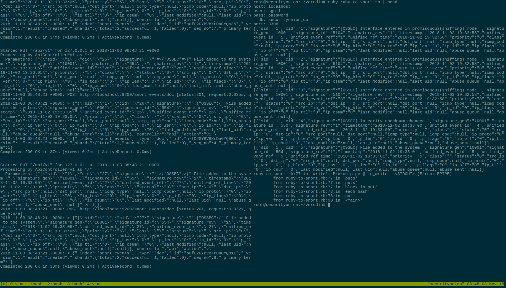
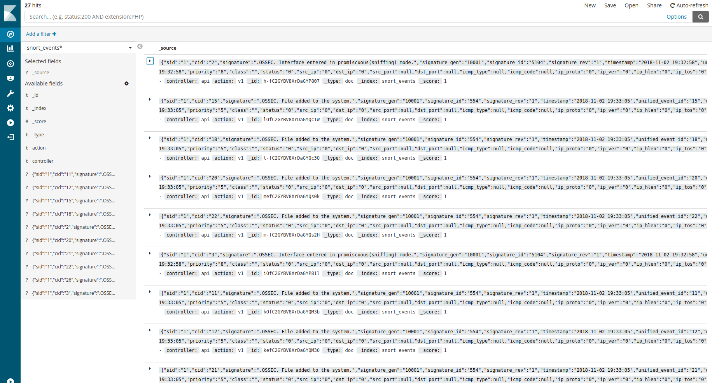

# verodin

Created in vim





## Run

Configure the ruby-on-rails server:

```
/bin/bash new_rail.sh
```

Run ruby service manually:

```
ruby ruby-to-snort.rb
```

Create linux service:

```
/bin/bash create_service.sh
```





